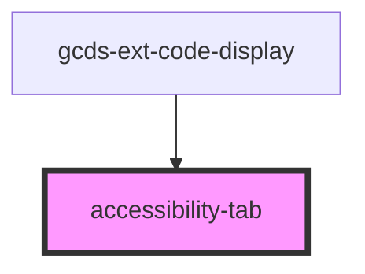

# accessibility-tab

<!-- Auto Generated Below -->

## Properties

| Property                      | Attribute          | Description | Type      | Default     |
| ----------------------------- | ------------------ | ----------- | --------- | ----------- |
| `displayElement` _(required)_ | --                 |             | `Element` | `undefined` |
| `landmarkDisplay`             | `landmark-display` |             | `boolean` | `undefined` |

## Dependencies

### Used by

 - [gcds-ext-code-display](../gcds-ext-code-display)

### Graph

----------------------------------------------

*Built with [StencilJS](https://stenciljs.com/)*
