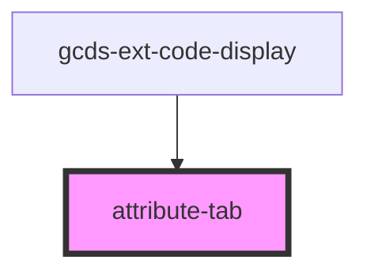

# attribute-tab

<!-- Auto Generated Below -->

## Properties

| Property                      | Attribute | Description | Type               | Default     |
| ----------------------------- | --------- | ----------- | ------------------ | ----------- |
| `attributeObject`             | --        |             | `AttributesType[]` | `undefined` |
| `displayElement` _(required)_ | --        |             | `Element`          | `undefined` |

## Events

| Event             | Description | Type                  |
| ----------------- | ----------- | --------------------- |
| `attributeChange` |             | `CustomEvent<Object>` |
| `statusUpdate`    |             | `CustomEvent<Object>` |

## Dependencies

### Used by

 - [gcds-ext-code-display](../gcds-ext-code-display)

### Graph

----------------------------------------------

*Built with [StencilJS](https://stenciljs.com/)*
