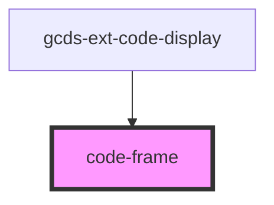

# element-display

<!-- Auto Generated Below -->

## Properties

| Property          | Attribute          | Description | Type                                      | Default     |
| ----------------- | ------------------ | ----------- | ----------------------------------------- | ----------- |
| `accessibility`   | `accessibility`    |             | `boolean`                                 | `false`     |
| `framework`       | `framework`        |             | `"angular" \| "html" \| "react" \| "vue"` | `'html'`    |
| `landmarkDisplay` | `landmark-display` |             | `boolean`                                 | `false`     |
| `source`          | `source`           |             | `string`                                  | `undefined` |

## Events

| Event          | Description | Type                  |
| -------------- | ----------- | --------------------- |
| `statusUpdate` |             | `CustomEvent<Object>` |

## Dependencies

### Used by

 - [gcds-ext-code-display](../gcds-ext-code-display)

### Graph

----------------------------------------------

*Built with [StencilJS](https://stenciljs.com/)*
